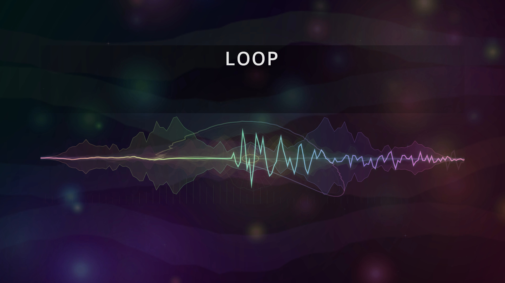

# visu-visu

`visu-visu` turns a song into a deterministic, audio-reactive music video. It analyzes the full track first, then renders every video frame from absolute time, cached features, and a seeded visual plan.

The initial preset is **Rainbow Signal Dream**: a prismatic noise-and-bokeh field, flowing aurora ribbons, morphing halo and figure-eight forms, a forward-travelling spectrum tunnel, layered waveforms, music-triggered shockwaves and prism streaks, glints, vignette, and restrained grain. A deterministic visual conductor reads rolling energy, onset density, and build/drop trend so quiet passages open up, builds accelerate through depth, and peaks add trails, camera energy, and stronger hero shapes. Loudness controls exposure and breathing, bass expands the scene, mids bend its motion, treble sharpens detail, and spectral flux drives short color accents. Every layer is derived from absolute time and seeded analysis, so the result is reactive without sacrificing reproducibility. The only rendered text is the title and artist, placed with aspect-aware safe zones for TikTok, Instagram, YouTube, and Vimeo players.

Text and signal graphics use an aspect-aware safe composition. Landscape output reserves the hover-title and player-control bands; square and portrait output also reserve additional bottom space for captions and right-side space for TikTok/Reels action controls.

Every MP4 contains the song as stereo AAC-LC at 384 kbps and 48 kHz. This exceeds the requested 320 kbps quality while remaining more compatible with MP4 upload pipelines than an MP3 stream.

Final renders are high-fidelity upload masters: Canvas runs at the native delivery resolution, then FFmpeg encodes H.264 High Profile at CRF 8 with the slow preset, BT.709 color, two B-frames, and a closed half-frame-rate GOP. This is near-transparent rather than mathematically lossless, and intentionally produces larger, slower files that give YouTube and other platforms a cleaner source for their own transcode. The format follows [YouTube's recommended upload settings](https://support.google.com/youtube/answer/1722171); use preview quality while tuning.

## Showcase

[](./test-e2e/loop.mp4)

[Watch the generated Full HD MP4](./test-e2e/loop.mp4) · [Source WAV fixture](./test-e2e/loop.wav)

Regenerate the committed native Full HD upload-master showcase with `bun run showcase:loop`.

## Quick start

Requirements:

- [Bun](https://bun.sh/) 1.3 or newer
- `ffmpeg` and `ffprobe` on `PATH`, with H.264 (`libx264`) and AAC support

Install and render:

```sh
bun install
bun run render -- ./song.mp3 \
  --title "Night Signal" \
  --artist "Artist Name" \
  --output ./renders/night-signal.mp4
```

Every MP4 includes stereo AAC-LC audio at 48 kHz and a 384 kbps target bitrate. This exceeds the requested 320 kbps compressed-audio quality while retaining broad upload compatibility.

The default is a native-resolution, high-fidelity Full HD master: `1920×1080` at 30 fps. Other delivery shapes retain a Full HD long edge when selected explicitly:

```sh
bun run render -- ./song.mp3 --resolution fullhd --ratio 16:9
bun run render -- ./song.mp3 --size 1920x1080
```

For a quick, eight-second draft:

```sh
bun run preview -- ./song.mp3 --overwrite
```

The preview script still writes a `1920×1080` delivery file, but renders its Canvas scene at half scale and uses a faster quality profile. Set `--start 45` to inspect a later section.

For a quick smoke test, one command writes a 640×360 draft to the ignored root-level `loop.mp4`:

```sh
bun run test:loop
```

Use `bun run showcase:loop` when intentionally refreshing the committed Full HD showcase.

## Deterministic two-stage processing

Analysis is an explicit, reusable artifact:

```sh
bun run analyze -- ./song.flac --output ./song.analysis.json

bun run render -- ./song.flac \
  --analysis ./song.analysis.json \
  --seed charcoal-17 \
  --output ./renders/song.mp4
```

The analysis contains time-indexed RMS, peak, a log-frequency spectrum, bass/mid/treble energy, spectral centroid, spectral flux, onset strength, and waveform samples. Track-level percentiles normalize these values before rendering.

Cached analysis is bound to the exact source file as well as its decoded PCM. The renderer rejects a cache paired with another audio file, malformed feature values, unsupported versions, or inconsistent frame counts. JSON caches are capped at 128 MiB in this first format; longer-form sets should currently be analyzed as part of the render instead of saved.

With the same decoded audio, settings, seed, renderer version, and runtime environment, the renderer generates the same RGBA frame sequence. The automatic seed is derived from decoded PCM and output settings. An explicit `--seed` makes visual exploration intentional and repeatable. System font rasterization and native codec implementations can still produce small byte-level differences across operating systems.

## Project configuration

[`visu.config.json`](./visu.config.json) contains the complete initial preset. Pass it explicitly so experiments remain reviewable:

```sh
bun run render -- ./song.wav --config ./visu.config.json
```

```json
{
  "version": 1,
  "output": {
    "width": 1920,
    "height": 1080,
    "fps": 30,
    "renderScale": 1,
    "crf": 8,
    "preset": "slow"
  },
  "text": {
    "title": "",
    "artist": ""
  },
  "visual": {
    "seed": "auto",
    "intensity": 1,
    "bokehCount": 48,
    "spectrumBands": 64,
    "grain": 0.018,
    "vignette": 0.28,
    "lowFlash": true
  }
}
```

Useful output shorthands:

| Command | Result |
| --- | ---: |
| `--resolution hd --ratio 3:2` | `1280×854` |
| `--resolution fullhd --ratio 3:2` | `1920×1280` |
| `--resolution fullhd --ratio 16:9` | `1920×1080` |
| `--resolution fullhd --ratio 9:16` | `1080×1920` |
| `--resolution 4k --ratio 16:9` | `3840×2160` |
| `--size 1080x1080` | exact custom size |

Dimensions are rounded to even pixels for broadly compatible H.264 output.

`--duration` is quantized upward to complete video frames. For example, `0.51` seconds at 12 fps becomes 7 frames and is reported as `0.58` seconds, matching the encoded stream.

`renderScale` controls the internal Canvas resolution independently of the encoded resolution. Final quality defaults to `1`, so a Full HD master is drawn natively at `1920×1080` with no source upscale. `--quality preview` switches to a half-scale Canvas, CRF 20, and the `veryfast` encoder preset while still producing the requested delivery dimensions. Explicit `--quality final` restores native scale, CRF 8, and the `slow` preset even when a project config contains draft settings.

## Platform-safe composition

Fog and bokeh remain full bleed, but title, artist, waveform, spectrum, and analysis bars stay inside conservative player-safe rectangles:

| Output shape | Content bounds | Graph bounds |
| --- | --- | --- |
| Landscape | `x 8–92%`, `y 16–80%` | `y 40–72%` |
| Square | `x 8–80%`, `y 16–62%` | `y 38–60%` |
| Portrait | `x 12–76%`, `y 16–62%` | `y 38–60%` |

Vertical and square outputs reserve extra room for captions, progress controls, and right-side reaction/action buttons. Long title and artist strings are measured, centered, scaled to the safe width, and clipped to the upper text region as a final guard.

Useful platform renders:

```sh
# TikTok / Instagram Reels / YouTube Shorts
bun run render -- ./song.wav --resolution fullhd --ratio 9:16

# YouTube / Vimeo landscape
bun run render -- ./song.wav --resolution fullhd --ratio 16:9
```

Run `bun src/cli.ts --help` for every option.

## Pipeline

```text
song
  └─ FFmpeg decode → mono 24 kHz PCM
       └─ deterministic offline analysis → optional .analysis.json
            └─ absolute-time, seeded Canvas2D renderer → RGBA frames
                 └─ FFmpeg H.264 + original audio AAC → .mp4
```

The renderer never reads wall-clock time and never calls `Math.random()`. Aurora, bokeh, sparkles, fog, and onset prism events have fixed seeded identities and analytic motion. The section conductor, halo, travelling tunnel, shockwave, spectrum, orbital form, and waveform layers read current, future, or historical analysis frames by absolute timestamp. This keeps direct seeking deterministic and leaves future parallel frame rendering possible.

See [docs/architecture.md](./docs/architecture.md) for module boundaries and the intended studio evolution.

## Development

```sh
bun run typecheck
bun test
bun run check
```

Tests cover the FFT, normalized analysis, strict cache validation, aspect-aware safe zones, configuration, seeded randomness, repeatable RGBA rendering, and an FFmpeg/ffprobe A/V integration render. A practical smoke test is a short preview followed by:

```sh
ffprobe -v error -show_streams -show_format ./renders/example.mp4
```

Start with `bun run test:loop` or the preview preset while tuning a seed, title, and composition. Use final quality for the upload artifact; native-resolution CRF 8 encoding is deliberately slower and larger.
