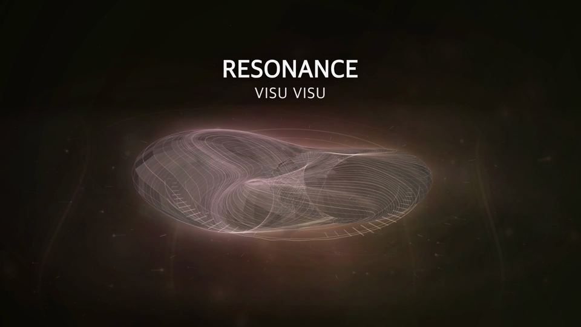

# visu-visu

`visu-visu` turns a song into a deterministic, audio-reactive music video. It analyzes the full track first, then renders every video frame from absolute time, cached features, and a seeded visual plan.

The initial preset is **Resonance**. With a cover image, the cover becomes the room: the illustration fills the frame at its real colours on a base of its own darkest swatch, drifts slowly between its brightest and its most colourful regions, and pushes in and brightens around every drop. A sculpture of 72 harmonic filaments stands inside it, drawn in the cover's own warm and cool pigments (bass strands warm, treble strands cool), small and wispy in quiet passages, large and bright at peaks, and leaning into every kept kick with the momentum of something heavy. The music is legible in two readouts in the bottom band: a 32-bar spectrum strip running from warm bass to cool treble, and a floor oscilloscope with phosphor persistence. Every hit is one thing: a coloured ripple ring from the object's core plus a rate-limited warm lift with an explicit flash budget. The cover's own sparks float as soft ember bokeh on two parallax planes, the video visibly begins and ends, and the title lockup stays centred and readable throughout.

The sculpture opens into a ring, closes toward an orb and folds into a flowing plasma knot. Broad 3D precession, flower-like lobes and changing proportions make its silhouette move with the song, and a closer framing follows the complete projected shape. Bass and kicks drive the largest folds, the camera's zoom and the sculpture's size; mids shape slower flow; high frequencies add smaller, faster ripples. Contour tracers glide along the front strands. A translucent skin of the cover photograph (or a flowing silk material without one) sits under the filaments, lit by three moving palette lights and the reflected spectrum, exposed above its own halo. That halo is three blurred, saturated copies of the emission field in the cover's pigments, pulsing with the kick and never clipping to white.

Hits come from one cached hit plan: every onset is ranked against its neighbours within eight seconds and at most one hit is kept per 0.34 seconds, so kicks, snares and hats differ and intro taps stay small. A kept hit draws a ripple ring from the core behind the sculpture (warm for kicks, cool for hats) that eases out toward the graph reserve, blurring as it grows until it is lost in the room within 0.7 seconds; no two rings are alike, each has its own size, aspect, thickness, tilt and drift direction fixed by the seed. A hit also draws a short burst of the same pigment in the light field, and a warm lift of the whole frame. Low-flash mode is the default and caps only light: geometry (zoom, sculpture size, bar length, ring radius, scope amplitude) is never capped; luminance transients are capped at half strength, ring light ramps in over 50 ms, and the lift stays under +0.05 mean luma, so a hit frame and the frame 0.4 seconds later differ by at most 0.08 in mean luma.

Occasional bass accents also leave a faint frozen ghost of the sculpture behind the live geometry. Its shape, texture, lighting and camera remain fixed while it gently approaches the viewer, growing to about twice its original size. Each ghost stays recognizable for its first second, then softens and dissolves over 7.5 seconds into a faint cloud at no more than 20% opacity. Up to three overlapping impressions add depth while leaving the live sculpture and credits clear. Both exported videos and the live WebGL preview include this object history.

Sparse bass impulses also peel small, irregular pieces from the actual surface. The curved patches retain their photograph or silk texture and captured lighting, leaving matching temporary tears in the moving sculpture. Up to four feather-edged pieces per burst slowly tumble and approach the viewer, becoming softer and fading over 6.3 seconds; the live surface heals within 2.7 seconds. At most three bursts overlap. Fragment motion and timing are shared by exported videos and the live preview, preserving the source palette and reproducible seeking.

The supplied cover photograph wraps around the morphing sculpture, preserving its spatial image details and colours beneath the luminous filaments. Its luminance adds shallow surface relief; without artwork, the object uses a flowing-silk material with matching texture, normal and roughness maps. The spectrum also becomes a moving band of coloured light: surface normals bend its reflections around the sculpture, and roughness softens its highlights. Spectrum and oscilloscope signals shape the relief and fine detail, connecting material, geometry and music. Three moving coloured lights add depth: bass drives the broadest, strongest light, mids provide a slower fill, and treble contributes a smaller, quicker rim. Cover art remains recognizable behind the scene and credits. Wide, soft shadows follow the title and artist letters, and the cover is gently shaded under the lockup, keeping the credits readable while the image continues naturally across the frame.

The bottom band below the sculpture carries the two readouts. Thirty-two rounded bars grow from a baseline near the bottom edge, each normalised to its own band's ceiling over the whole track, so quiet hats reach the top of their bars just as loud kicks do; the lowest bars jump with the raw kick a frame before the FFT envelope follows, and the whole strip is calmer in quiet sections. Above the bars, the frame's signed waveform lies along the floor with its two previous frames trailing at decaying brightness, its swing following the fast loudness envelope and its brightness the raw treble pulse. Both readouts share the scene palette, sit outside the sculpture's clip, and survive small previews and chroma subsampling.

Around the sculpture, luminous waveform and spectrum ribbons leave a short history that expands, curls and fades into the room. An outward spiral and a folded ribbon flow gradually blend across the image, while bass drives the broadest movement, mids bend the flow and treble adds smaller ripples. Older traces grow softer and fainter; all their colours come from the same cover palette or seeded fallback. This draws on the warped trails and simultaneous visual layers of [MilkDrop3](https://github.com/milkdrop2077/MilkDrop3), with an original implementation shared by the export and live preview. Each trace is reconstructed from its historical audio samples and absolute age, keeping seeks reproducible and leaving the cover, current sculpture and credits clear.

Six independent music responses give the scene different kinds of momentum: the bloom and the embers' rise follow the slower tiers, the sculpture and camera follow bass, fine surface details move with mids, and the smallest embers sparkle with the highs. Their response delays range from 15 to 180 milliseconds, with separate inertia and decay, so size, light and motion ease into each musical change at different speeds. The raw band envelopes still reach the picture directly, so quiet sections stay visibly quieter than loud ones. Kicks reach everything with mass as smoothed pushes of different weight: the room leans in over 140 ms, the camera over 110 ms, the warm lift and the core burst over 100 ms, the sculpture's fold over 80 ms and the bloom's smear within 45 ms, each settling back before the next beat instead of stepping on the hit frame. The sculpture's surface follows the same 32 spectral envelopes as the bars (32 ms attack, 120 to 400 ms release), so a hit builds over a few frames and FFT noise never crawls across the mesh.

Ember bokeh sampled from the cover's own brightest saturated pixels floats through the room: a far plane under the sculpture's bloom and a near plane in front of everything but the credits. Each ember pulses with its own spectrum band, rises faster in loud passages, swells on the kick when it is near the lens, and follows the camera and the cover's drift with plane-dependent parallax. The frame's colour temperature follows the track-relative spectral centroid and the section loudness, tinting whole sections toward the cover's cool or warm pigment without darkening them. The sculpture arrives over the first three seconds and steps back before the end, so the video visibly begins and ends. Colours stay within the cover's palette, and the cover and credits remain readable.

The deterministic conductor compares each section with the track's own energy range, then hands the scene between ambient, build, peak and release modes. A symmetric five-second section level leans the picture into a drop about 2.5 seconds early and relaxes it the same distance after: the room zooms and brightens, the sculpture grows, the skin solidifies and the readouts open up. Quiet passages leave space around the sculpture; peaks increase deformation and light; releases soften the scene. Every layer is derived from absolute time, cached analysis and seeded plans, so the result remains reproducible. Large, high-contrast title and artist typography uses restrained letter spacing and aspect-aware safe zones for TikTok, Instagram, YouTube and Vimeo players.

With a cover image, a rounded thumbnail spans both credit lines beside the left-aligned title and artist. The image and two-line text block are vertically centered together, and the complete group is centered horizontally in the video. Without a cover, both text lines remain centered. The sculpture uses a separate safe composition: landscape output reserves the hover-title and player-control bands; square and portrait output also reserve additional bottom space for captions and right-side space for TikTok/Reels action controls.

Every MP4 contains the song as stereo AAC-LC at 48 kHz with a 384 kbps target bitrate.

Picture and audio fade in together from black and silence over the first three seconds, then fade back to black and silence over the final three seconds. The fades happen inside the existing runtime; they do not add silent lead-in or tail time. Outputs shorter than six seconds divide their available duration evenly between the two ramps. Set `--fade 0` to disable them or `--fade <seconds>` to choose another duration.

Final renders default to native **1920×1080 at 60 fps**, encoded as H.264 High Profile at CRF 18 with the `fast` preset, a 16 Mbps video ceiling and a 32 Mbit buffer. MP4 faststart, yuv420p pixels, BT.709 color, two B-frames and a closed half-second GOP provide an upload format with controlled file size. The 16 Mbps ceiling is this project's quality choice; [YouTube's recommended upload settings](https://support.google.com/youtube/answer/1722171) give 12 Mbps as the 1080p high-frame-rate reference. Use `--quality master` for an optional CRF 8, `slow`, uncapped archive copy.

## Showcase

[](./test-e2e/loop.mp4)

[Watch the generated Full HD60 MP4](./test-e2e/loop.mp4) · [Source WAV fixture](./test-e2e/loop.wav)

Regenerate the committed native 1920×1080, 60 fps showcase with `bun run showcase:loop`. Run `bun run showcase:portrait` for a 1080×1920, 60 fps version in `renders/resonance-portrait-60.mp4`. Both display **RESONANCE** and **VISU VISU**. The six-second fixture uses short 0.5-second edge fades so its visuals remain useful as a demo; normal renders retain the three-second production default.

## Quick start

Requirements:

- [Bun](https://bun.sh/) 1.3 or newer
- `ffmpeg` and `ffprobe` on `PATH`, with H.264 (`libx264`) and AAC support

Install and render:

```sh
bun install
bun run render -- ./song.mp3 \
  --title "Night Signal" \
  --artist "Artist Name" \
  --output ./renders/night-signal.mp4
```

The default is native Full HD at 60 fps with the compact upload profile. Choose landscape for YouTube or portrait for TikTok:

```sh
bun run render -- ./song.mp3 --size 1920x1080 --fps 60 --quality final --output ./renders/youtube.mp4
bun run render -- ./song.mp3 --size 1080x1920 --fps 60 --quality final --output ./renders/tiktok.mp4
```

For a quick, eight-second draft:

```sh
bun run preview -- ./song.mp3 --overwrite
```

The preview script still writes a `1920×1080` delivery file, but renders its Canvas scene at half scale and uses a faster quality profile. Set `--start 45` to inspect a later section.

## Input artwork

Pass a local PNG, JPEG, WebP or AVIF image to supply the scene's colors and artwork background:

```sh
bun run render -- ./song.wav --image ./cover.jpg \
  --title "Night Signal" --artist "Artist Name" \
  --output ./renders/night-signal.mp4

bun run clip -- ./song.wav --image ./cover.jpg --artist "Artist Name"
```

The cover is the room. It is prepared once at up to 768 pixels on its long edge with a gentle blur, its luminance compressed only slightly (the brightest pixels stay near 80% white) and 85% of its chroma retained, then drawn source-over on an opaque base of its own darkest swatch, so its colours reach the frame as they are. Three fades are baked into the texture: a soft hole of at most 42% behind the sculpture, a corner vignette of at most 45%, and a 40% shade inside an ellipse around the title lockup, so the credits keep their contrast without a dark stripe. Broad, softly blurred shadows still sit directly behind the title and artist letters.

The room moves with the song. Its zoom rises from 1.06 in quiet passages to 1.18 at the loudest sections and leans in by up to 2.5% on each kept kick, peaking 140 ms after the hit and settling within half a second; its opacity rises from 0.80 to 0.94 with the section, so the picture brightens about 2.5 seconds before a drop and relaxes after it. A 48-second Ken Burns drift pans between the cover's two focal points, measured once on a small crop: the brightest region (the window of a lit scene) and the most colourful one (the figure), with a slow wander added; the offset never exceeds the margin the zoom creates, so the base beneath never shows. A third of the sculpture camera's pan is added as parallax. Colour is never graded on the cover itself.

A separate, unmasked copy of the complete cover becomes the object's texture at up to 512 pixels on its long edge. It retains the photograph's spatial arrangement and transparency rather than replacing it with sampled palette colours, and it remains visible under the filaments and the reflected spectrum; frozen ghosts and detached surface patches retain the photograph and lighting from their capture time. The cover's brightest saturated pixels (at most 32, spaced apart) also become the ember colours, so the sparks floating through the room are literally the cover's own light.

The complete image supplies one shared palette before it is cropped for the output aspect ratio. Each palette swatch is the most chromatic real pixel of its colour cluster within a small colour budget, so a cluster of muted shades is represented by its pigment rather than its grey; two accent swatches are then named, the most chromatic warm one (red through yellow) and the most chromatic cool one (green through violet), with the darkest swatch as the base of the room. The sculpture, skin lights, bloom, strip, oscilloscope, hit rings, embers, grade and credit tint all use those source colours or neutral shades. Music changes their balance, brightness and saturation within that palette. A monochrome cover produces a monochrome visualization; a cover with one hue keeps that hue throughout the scene. Transparent pixels do not contribute colours, and the source file is not modified.

Without artwork, the renderer creates a two-family palette from the visual seed (an anchor with two neighbours and two near-complements), draws a cached nebula bed in that palette that brightens at peaks, keeps a palette-tinted vignette, and colours the embers with the two accents. Reusing the same seed repeats its colours; choosing another seed explores a different palette. The illuminated WebGL preview follows the same palette policy as exported videos.

Use `visual.imagePath` to store the image in a project config. Relative paths in that field resolve beside the config file; relative `--image` paths resolve from the current working directory and override the config value. Leave `imagePath` empty to use the procedural scene alone. SVG and image URLs are not supported. Reproducible artwork renders require the same image bytes as well as the same audio and visual settings.

## Textures and reactive lighting

The committed [material assets](./assets/materials/README.md) include a 512 × 512 albedo texture, height map, tangent-space normal map and roughness map. They come from one AI-generated grayscale relief source, processed into a seamless repeating surface. Runtime material color follows the scene palette while retaining the surface detail. The normal map changes how moving lights meet the surface; roughness controls the width of its highlights. The analyzed spectrum also illuminates the surface as a reflected band of palette colors. Its appearance follows each surface normal and the viewing direction; rougher areas spread the highlight. Low frequencies produce broader, stronger light, while high frequencies contribute narrower detail. Spectrum and signed waveform signals also perturb relief and shape fine reflections across the material skin. A packed 128 × 128 height field keeps runtime construction synchronous and inexpensive.

Lighting defaults to `0.65`. Use `--lighting 0..1` on `render` or `clip`, or set `visual.lighting` in your config:

```sh
bun run render -- ./song.wav --image ./cover.png --lighting 0.8
bun run clip -- ./song.wav --artist "Artist Name" --lighting 0.45
```

`--lighting 0` disables this material lighting. The three point lights and reflected spectrum follow absolute musical time and frequency envelopes, so direct seeks recreate the same light positions and highlights. The key light's intensity roughly doubles between quiet passages and peaks (its blended bass input spans about 0.3 to 0.8), and the skin's exposure rises with sustained energy so the object sits above its own halo. The skin itself is translucent in quiet passages and solid lit pigment at peaks. Low-flash mode halves the lights' pulse accents and tempers the reflected spectrum while retaining their motion. Without a cover, a low-resolution diffuse light on the seeded material also lights the nebula bed. The centered credit group is drawn after lighting; its large title and artist text remains unaffected by surface effects.

Regenerate all maps deterministically from the committed source:

```sh
bun run materials
# Optional: generate a separate procedural material without an image source.
bun run materials -- --procedural --out-dir ./renders/procedural-material
```

See the [material notes](./assets/materials/README.md) for source provenance, map conventions and custom source options. Regeneration preserves the source image.

## Live visualization preview

Explore the flowing sculpture, material maps and music-driven lights with a local WebGL preview:

```sh
bun run lighting:preview -- ./song.wav --image ./cover.png \
  --title "Night Signal" --artist "Artist Name" --low-flash
```

Open the printed local address, normally `http://127.0.0.1:4180`. Play or seek the song to explore a folded ring that opens, closes and bends into a knot, combining a translucent normal-mapped skin with luminous filaments and traveling tracers. Bass accents leave frozen ghosts that approach the viewer and dissolve into mist behind the moving object. The preview keeps its own set of surrounding layers that the export no longer draws: soft rotational bloom, flowing cloud curtains, forward-moving particles and bokeh, a soft shadow, local flare pulses, a spectrum corona with amplitude halos and a waveform orbit around the object, and a background lens that bends the cover around the sculpture's recent shapes. Camera roll, cover drift, breathing zoom and gradual palette changes follow the different delayed music responses. Switch between **Illuminated**, **Texture**, **Normal map** and **Roughness** views to inspect the same moving geometry; the normal-map view uses diagnostic RGB to show direction. The page draws at the browser's refresh cadence and reports its measured frame rate. Use `--port` to choose a different local port and `--seed` for repeatable light placement and a repeatable palette when no cover is supplied.

With `--image`, the preview maps that photograph onto the sculpture and uses normal and roughness maps derived from its full source. Sparse bass accents peel curved textured fragments toward the viewer while matching openings in the live surface gradually heal. The preview's spectrum corona, amplitude halos and waveform orbit read the same per-band and loudness envelopes that drive the export's spectrum strip and floor oscilloscope.

The WebGL preview combines the visualizer's flowing geometry with the material, lighting and frozen-history effects. Its GPU mesh uses 64 filaments with 192 segments each; exported videos use the offline 72-filament Canvas scene and full export composition. Use `render` or `clip` to create MP4s. The preview and export share musical signals, ghost and fragment capture timing, fragment trajectories and fade curves, with different mesh densities, layer sets and drawing paths rather than pixel-identical frames. Audio and optional artwork are served locally; the server binds to `127.0.0.1`.

## Smoke renders

For a quick smoke test, one command writes a 640×360 draft with the fixture's short 0.5-second fades to the ignored root-level `loop.mp4`:

```sh
bun run test:loop
```

Use `bun run showcase:loop` when intentionally refreshing the committed Full HD60 showcase, or `bun run showcase:portrait` to generate the vertical version.

For a quick portrait clip smoke render using the real audio fixture:

```sh
bun run test:clip
```

This writes the ignored root-level `clip.mp4` with large **RESONANCE** and **VISU VISU** credits. The fixture is about six seconds long, so the clip uses the whole song with a quick intro and a three-second fade-out. Delivery remains 1080×1920 at 60 fps; preview encoding and a quarter-scale Canvas render keep this smoke test quick.

## Automatic portrait clips

The separate `clip` command selects a highlight and creates a portrait **1080×1920, 60 fps MP4**, using the same music-reactive renderer and upload encoding:

```sh
bun run clip -- ./song.mp3 --title "Night Signal" --artist "Artist Name"
```

By default it looks for a strong, sustained bass-heavy drop, starts about **three seconds before it**, and renders **up to 30 seconds**. The entrance fades in over 0.35 seconds; picture and audio fade out together over the final three seconds. Responsive title and artist sizing fits the available width while keeping the artist line readable beneath the title. The credits sit above the visualization: a supplied cover and left-aligned text form one centered group, or the text alone is centered when no image is supplied.

A loud isolated hit does not count as a drop: selection combines the immediate energy jump, contrast with the preceding section, and sustained energy after the hit. If no distinct drop is found, the command chooses the strongest sustained-energy window instead. This is an audio-feature heuristic; use `--dry-run` to inspect its choice or `--drop` for a known musical timestamp:

```sh
# Read the selected source range, drop offset, effective fades and output profile.
bun run clip -- ./song.mp3 --artist "Artist Name" --dry-run

# Known drop at 1:32.5: start at 1:29.5, with the drop three seconds into the clip.
bun run clip -- ./song.mp3 --artist "Artist Name" --drop 92.5 --output ./renders/short.mp4

# A shorter excerpt, with a different lead-in and end fade.
bun run clip -- ./song.mp3 --artist "Artist Name" --duration 20 --lead-in 4 --fade-out 2
```

Title and artist come from `--title` / `--artist`, then project text settings, then audio tags. A missing title falls back to the filename; if the artist is still missing, the command asks for `--artist` instead of exporting an uncredited clip. Both lines use the existing large, high-contrast typography.

Default output is `<song>.clip.mp4`. Use `--overwrite` to replace an existing file. Clips always use 9:16; `--resolution`, `--fps`, `--render-scale`, `--quality`, `--seed`, `--image`, `--lighting`, `--config`, `--analysis` and `--save-analysis` remain available. The clip profile defaults to Full HD60 and `final` encoding even when the project config uses landscape dimensions or another frame rate. A reused analysis must match the selected frame rate and source file.

A source shorter than the requested clip is used in full. Drops near the beginning get the available lead-in; drops near the end keep the requested lead-in and produce a shorter excerpt. Sources are never looped to fill time. Fades shorten when necessary to keep the chosen drop at full volume, with a brief hold before the end fade. Very short excerpts proportionally fit the entrance and exit fades without overlap. Normal clip durations round down to complete frames; a fractional final source frame can add less than one frame of padded delivery time, reported separately as `renderedDuration` in dry-run JSON. `--duration` accepts at most 30 seconds; omitted lead-in becomes half the duration for clips shorter than six seconds.

## Deterministic two-stage processing

Analysis is an explicit, reusable artifact:

```sh
bun run analyze -- ./song.flac --output ./song.analysis.json

bun run render -- ./song.flac \
  --analysis ./song.analysis.json \
  --seed charcoal-17 \
  --output ./renders/song.mp4
```

The analysis contains time-indexed RMS, peak, a log-frequency spectrum, bass/mid/treble energy, spectral centroid, spectral flux, onset strength, and waveform samples. Track-level percentiles normalize these values before rendering. RMS attack and release use elapsed time so their response stays consistent across frame rates. Rhythm and beat controls use time-based onset envelopes; a flat onset peak fires once at its leading edge. Separate normalized band envelopes and integrated slow/fast musical time let sustained forms and rapid details respond at different speeds without jumping when the song's energy changes. Hits come from a cached plan built once from the track's onset events: an event never precedes its audio timestamp, its ring and lift depend only on its absolute age, and seeking never moves or adds a hit. The section level, the warmth track and the per-band strip ceilings are likewise windowed or track-wide statistics of the cached analysis.

Cached analysis is bound to the exact source file as well as its decoded PCM. The current analysis version remains **2**; regenerate older versions with `bun run analyze`. A cache must also match the output frame rate, so regenerate a 24 or 30 fps cache for a 60 fps render. The renderer rejects a cache paired with another audio file, malformed feature values, unsupported versions, or inconsistent frame counts. JSON caches are capped at 128 MiB; longer-form sets should currently be analyzed as part of the render instead of saved.

With the same decoded audio, input image bytes (if supplied), bundled material source, settings, seed, renderer version, and runtime environment, the renderer generates the same RGBA frame sequence. The current renderer version is **23**; analysis remains at version **2**. The automatic seed is derived from decoded PCM, output settings and the renderer version, so a renderer version bump also re-rolls the seeded plans (filaments, embers, nebula lobes, dither) of `auto`-seeded renders. An explicit `--seed` makes visual exploration intentional and repeatable. System font rasterization and native codec implementations can still produce small byte-level differences across operating systems.

## Project configuration

[`visu.config.json`](./visu.config.json) contains the complete initial preset. Pass it explicitly so experiments remain reviewable:

```sh
bun run render -- ./song.wav --config ./visu.config.json
```

```json
{
  "version": 1,
  "output": {
    "width": 1920,
    "height": 1080,
    "fps": 60,
    "renderScale": 1,
    "crf": 18,
    "preset": "fast",
    "maxBitrateMbps": 16,
    "fadeSeconds": 3
  },
  "text": {
    "title": "",
    "artist": ""
  },
  "visual": {
    "seed": "auto",
    "imagePath": "",
    "lighting": 0.65,
    "intensity": 1,
    "bokehCount": 48,
    "spectrumBands": 64,
    "grain": 0.03,
    "vignette": 0.28,
    "lowFlash": true
  }
}
```

`visual.intensity` scales every light layer (bloom, filaments, hit rings, lift, embers). `bokehCount` is the number of embers, split between the far and the near plane. `grain` is the strength of a seeded luminance dither added before the vignette (at `0.03` at most two levels per pixel, enough to break banding on the upscaled cover); `0` disables it. `vignette` applies only without a cover, tinted in the palette's darkest swatch; the cover carries its own baked corner fade. `lowFlash` (default `true`) is the flash policy described above: it never caps geometry, halves light pulses and caps luminance transients at 0.5, ramps hit light in over 50 ms and keeps the per-hit lift under +0.05 mean luma, with hits rate-limited to one per 0.34 seconds by the plan in either mode.

Useful output shorthands:

| Command | Result |
| --- | ---: |
| `--resolution hd --ratio 3:2` | `1280×854` |
| `--resolution fullhd --ratio 3:2` | `1920×1280` |
| `--resolution fullhd --ratio 16:9` | `1920×1080` |
| `--resolution fullhd --ratio 9:16` | `1080×1920` |
| `--resolution 4k --ratio 16:9` | `3840×2160` |
| `--size 1080x1080` | exact custom size |

Dimensions are rounded to even pixels for broadly compatible H.264 output.

`--duration` is quantized upward to complete video frames. For example, `0.51` seconds at 12 fps becomes 7 frames and is reported as `0.58` seconds, matching the encoded stream.

`fadeSeconds` controls synchronized picture-to-black and audio-to-silence ramps at both ends. Audio is timestamp-reset after source seeking, padded if frame quantization extends past the available source by a fraction of a frame, and trimmed to the exact video duration before fading.

`renderScale` controls the internal Canvas resolution independently of the encoded resolution. Final quality defaults to `1`, so Full HD is drawn natively at `1920×1080`. Quality presets replace the encoding settings and choose a render scale:

| Quality | Render scale | CRF | H.264 preset | Video ceiling |
| --- | ---: | ---: | --- | ---: |
| `--quality final` | `1` | `18` | `fast` | `16 Mbps` |
| `--quality preview` | `0.5` | `22` | `veryfast` | `8 Mbps` |
| `--quality master` | `1` | `8` | `slow` | uncapped |

All modes retain the configured frame rate, which defaults to 60 fps. An explicit `--render-scale` takes precedence over the preset's scale. The archive mode is lossy CRF encoding and produces larger files than the upload profile.

The optional `output.maxBitrateMbps` config field defaults to `16`, accepts finite values from `0` to `200`, and sets FFmpeg's video VBV ceiling in Mbps. The buffer is twice that value in Mbits; `0` disables the ceiling for uncapped CRF encoding. Actual average bitrate and file size depend on the scene. Omit `--quality` when retaining custom encoding settings from a project config.

## Platform-safe composition

The cover room (or the seeded nebula) and the ember planes fill the frame. The sculpture, its skin, its bloom and the hit rings use a clipped graph region under one shared camera; the spectrum strip and oscilloscope occupy the band below it, on the main canvas and off that camera, so the sculpture can never cover them; title and artist occupy a separate symmetric safe text region:

| Output shape | Text width | Graph bounds | Signal band |
| --- | --- | --- | --- |
| Landscape | `x 8–92%` | `x 8–92%`, `y 32–78%` | scope rest line `y 81.6%`, bars up from `y 92%` |
| Square | `x 8–92%` | `x 8–80%`, `y 30–60%` | scope rest line `y 63.6%`, bars up from `y 74%` |
| Portrait | `x 12–88%` | `x 12–76%`, `y 30–60%` | scope rest line `y 63.6%`, bars up from `y 74%` |

The band uses the same height fractions in every orientation (the scope's rest line 3.6% and the bar baseline 14% of the height below the graph, bars at most 8.2% tall), spanning the graph's horizontal extent. In portrait and square output it deliberately enters the caption reserve as decoration; it never carries text. The complete cover-and-text credit group shares the horizontal midpoint of the video. The rounded cover sits to the left of the vertically centered, left-aligned text block; without artwork, both credit lines share the video midpoint. The cover is shaded and the embers dim inside an ellipse around the lockup, so it stays the brightest, cleanest thing in the frame at any camera pose. Vertical and square graph bounds reserve extra room for captions, progress controls, and right-side reaction/action buttons. Long title and artist strings are measured and scaled to the available space within the symmetric safe region. Their soft shadows can feather beyond the letters without a rectangular boundary.

Useful platform renders:

```sh
# TikTok / Instagram Reels / YouTube Shorts
bun run render -- ./song.wav --resolution fullhd --ratio 9:16 --fps 60 --quality final --output ./renders/portrait.mp4

# YouTube / Vimeo landscape
bun run render -- ./song.wav --resolution fullhd --ratio 16:9 --fps 60 --quality final --output ./renders/landscape.mp4
```

The portrait profile fits [TikTok's media transfer specifications](https://developers.tiktok.com/docs/en/content-posting-api-media-transfer-guide), which recommend MP4/H.264 and accept 23–60 fps with each dimension between 360 and 4096 pixels.

Run `bun src/cli.ts --help` for every option.

## Pipeline

```text
song
  └─ FFmpeg decode → mono 24 kHz PCM
       └─ deterministic offline analysis → optional .analysis.json
            └─ absolute-time, seeded Canvas2D renderer → RGBA frames
                 └─ FFmpeg H.264 + original audio AAC → .mp4
```

The offline renderer never reads wall-clock time and never calls `Math.random()`. Every per-frame signal (scene dynamics, blended motion, the raw kick, the hit momentum, section level, presence, conductor state, grade, lights, camera pose, filaments, hits and the signal band) is derived once per frame from the cached analysis and absolute time, and captures of the sculpture for fragments and frozen ghosts derive the same set for their own capture time. Filaments, nebula lobes, embers, material placement, moving lights and the dither sheets use seeded plans or analytic motion. Slow and fast musical time come from cached prefix integrals of audio envelopes, so speed can react to the song while direct seeking follows the same path. The hit plan, the per-band strip ceilings, the section-level and warmth prefix sums and the cover's focal points are computed once per analysis or per cover. The no-cover nebula is cached in frame-aligned buckets with source-analysis identity checks. Frozen ghosts and surface fragments use a sparse bass-event plan: each small cached snapshot is rebuilt from its event's fixed capture time, then aged by its absolute age. The bloom is rebuilt for each frame and uses the sculpture's camera transform to stay aligned with the emitting geometry. The conductor and all music-reactive layers read analysis by absolute timestamp, keeping direct seeking deterministic and leaving future parallel frame rendering possible.

See [docs/architecture.md](./docs/architecture.md) for module boundaries and the intended studio evolution.

## Development

```sh
bun run typecheck
bun run test
bun run check
```

`bun run test` runs the regular suite in `test/`; `bun run check` runs type checking and that same suite. Tests cover the FFT, normalized analysis, frame-rate-aware envelopes, onset timing, strict cache validation, adaptive section choreography, the section level, warmth and presence curves, slow/fast music motion, frequency-weighted effects, centered credits and aspect-aware graph bounds, changing resonance silhouettes, the cached hit plan (causality, refractory, ranking, ring light and reach), the signal band (per-band normalisation, bounds in every orientation, seek independence), ember bokeh (seeded plans, bounded poses, credit clearance, parallax), frozen-cloud capture timing and deterministic dissolution, artwork preprocessing, focal points, credit shade, the cover camera, chroma-aware palette medoids and accent swatches, coherent material generation and normal conventions, wrapped sampling, deterministic light positions, surface-normal-dependent spectrum lighting, six causal spectral/momentum tiers, bounded shading, low-flash motion preservation, the per-hit flash budget, seek-order-independent cover frames, the profiler hook, configuration, seeded randomness and repeatable RGBA rendering. Real FFmpeg tests encode and decode native landscape and portrait Full HD60 videos, checking each distinct frame, A/V timing, upload codecs and color, bitrate limits and faststart.

Run the longer CLI-to-MP4 clip test separately:

```sh
bun run test:e2e:clip
# All tests in test-e2e/:
bun run test:e2e
```

The automated clip E2E generates a longer audio fixture with a known drop and passes a busy cover image through the public `clip --image` CLI. It checks a 30-second portrait MP4, the drop three seconds into the excerpt, all 1,800 frames at 60 fps, H.264/AAC encoding, matching audio/video duration, song and artist metadata, and decoded picture/audio fades. Both credit lines must remain visible beside the cover in a decoded 360-pixel-wide portrait preview. The test distinguishes the colorful thumbnail from text ink, checks the combined group is centered, and measures fades on the artist text independently. Output uses the default 1080×1920 delivery size with a quarter-scale internal render to limit test time. This verifies full-length clip selection and export; `bun run test:clip` is the shorter, six-second real-audio smoke render for visual inspection. Both require FFmpeg and FFprobe on `PATH`. Bare `bun test` discovers both suites, including the longer E2E.

### Measuring a change

Four scripts under [`scripts/`](./scripts/) judge a visual change objectively. They need a saved analysis (`bun run analyze`) and, for cover renders, a project config whose `visual.imagePath` points at the cover; `renders/` is ignored by git and is a convenient place for their output:

- `bun scripts/stills.ts --analysis <song>.analysis.json --config <project>.json --times 12,30.2,52 --out renders/after/cover` renders single PNG frames without encoding and prints the per-frame time. `--yuv420p` also saves each frame after the encoder's RGBA → yuv420p (BT.709, limited range) → RGBA round trip, i.e. what chroma subsampling leaves of thin coloured structure. `--strip <seconds>` renders that many seconds of consecutive frames from the first time (use `--scale 0.25` for a 480×270 view), saves a contact sheet and prints each frame's mean absolute difference to the previous one, marking the frames on which the hit plan starts a hit and the frames whose difference spikes.
- `bun scripts/measure.ts <png...>` prints per image the mean luma, mean HSV saturation, colorfulness, bright/near-black/white-fog/vivid shares, the 99th-percentile luma, the mean R − B (colour temperature) and the mean absolute difference to the previous image. `--box x,y,w,h` (fractions of the frame) restricts every statistic to a region such as the graph rect or the signal band; `--hues` adds a chroma-weighted hue histogram; `--gate <dir>` reads the standard stills from a directory and exits non-zero unless they meet the accepted targets (cover luma and saturation at 12 and 52 s, near-black share, title-band brightness, graph-rect saturation and white fog, strip-band vivid share, no-cover near-black share).
- `bun scripts/profile-stages.ts --analysis ... --config ... --time 52 [--frames 30] [--budget 170]` prints milliseconds per render stage. `@napi-rs/canvas` rasterises lazily, so a naive timer around a draw call under-reports it; the renderer's optional `profiler` hook is called after each stage with the surface it drew to and the script flushes that surface before taking the time. It reports warm frames, one cold seek on a fresh renderer, and `--budget <ms>` fails the run when the warm mean exceeds it; `--src <dir>` profiles another checkout for comparison.
- `bun scripts/determinism.ts --analysis ... --config ... --time 52 --seeks 12,75` renders the frame at `--time` on a fresh renderer and again on another fresh renderer after the listed seeks; the two buffers must be byte-identical.

For a manual output check:

```sh
ffprobe -v error -show_streams -show_format ./renders/example.mp4
```

Start with `bun run test:loop` or the preview preset while tuning a seed, title, and composition. Use final quality for upload and master quality when keeping an additional archive copy.
